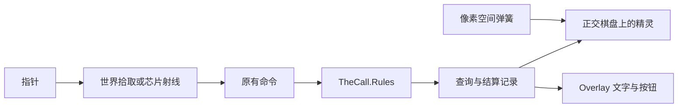

# 世界空间棋盘方案

结论：值得转，而且规则层已经拆开，转的是表现。不要把整套界面都变成场景物体，也不要用刚体换掉现在的关节弹簧。管线已经是 URP 2D Renderer（[Assets/Settings/PC_RPAsset.asset](Assets/Settings/PC_RPAsset.asset) 的 `m_RendererType: 1`），2D 光只照 `SpriteRenderer`，照不到现在的 `Image`。所以怪物、槽位底板、以后会碰到的东西要离开 Canvas；按钮、数字、图鉴、科研、设置继续 Overlay。

## 现在是什么

可玩场景是 [Assets/Scenes/Main.unity](Assets/Scenes/Main.unity)。唯一的 `UICanvas` 是 Screen Space Overlay。主相机是透视机位，不画这块 UI，也不参与点击。`Assets/Scripts` 里没有 `Rigidbody2D`。

玩家能点、能拖的全是 UGUI：

- 操作拖放：[OperationPointer.cs](Assets/Scripts/Presentation/OperationPointer.cs) 用 `EventSystem.RaycastAll`，落到 [OperationZone.cs](Assets/Scripts/Presentation/OperationZone.cs)，再发 `CommitOperationDropCommand`。落点仍是笼、提取格、培育位、废弃、技能口、技能槽、空处。
- 悬停：[HoverSample.cs](Assets/Scripts/Presentation/Hover/HoverSample.cs) 要求锚点是 `RectTransform`，窗口位置是画布局部坐标。
- 结算：[ScoringShow.cs](Assets/Scripts/Presentation/Scoring/ScoringShow.cs) 约 1300 行，用 `DOAnchorPos` / `DOShakeAnchorPos` / `DOJumpAnchorPos`。它和操作屏是同一块棋盘，`ScoringStage` 强制 `BoardRoot`、`DragLayer` 为 `RectTransform`。
- 画像：[MonsterPortrait.ApplyRig](Assets/Scripts/Presentation/Hover/MonsterPortrait.cs) 把骨架帧写进 `Image.rectTransform`。同一组件也被 [MonsterSlotView.cs](Assets/Scripts/Presentation/Hover/MonsterSlotView.cs)、[ShopCardView.cs](Assets/Scripts/Presentation/Hover/ShopCardView.cs)、[ResultScreenView.cs](Assets/Scripts/Presentation/ResultScreenView.cs) 使用。

已经像物理、但不是物理的部分：

- [MonsterMotionController.cs](Assets/Scripts/Presentation/Hover/MonsterMotionController.cs) 是手写半隐式欧拉，单位是画像像素和度。抓住时身体贴指针，不是力。关节是一维角弹簧，硬上限外加 0.2 回弹。这套和网页 `motion.js`、编辑器测试对齐。
- 靠近生产区放大是 [CarryScale.cs](Assets/Scripts/Presentation/Hover/CarryScale.cs) 的屏幕距离。
- 结算里的走动、对飞、抖动、弹出是 DOTween 的锚点补间。头脚「弹一下」已经交给上面的控制器，不是刚体。

[Assets/Notes/归档/怪物组合与动态运动落地报告.md](Assets/Notes/归档/怪物组合与动态运动落地报告.md) 写过：这不是刚体；若要碰撞或改 `SpriteRenderer`，再换世界空间。骨架数值（[MonsterRigSkeleton.cs](Assets/Scripts/Presentation/Hover/MonsterRigSkeleton.cs)、运动控制器）不引用 Canvas，可以原样留在像素空间，显示时除以现有的 100 PPU。

规则按 ADR 0004 / 0006 留在无引擎程序集 [TheCall.Rules.asmdef](Assets/Scripts/Core/Rules/TheCall.Rules.asmdef)。格子、空档、相邻、换位、结算记录顺序都不进世界坐标。结算先算完终局，演出再改视线。这条不能破。

## 转的时候守住的边界

- 命令和查询不改签名。放置仍是怪物编号加区域加格子下标。
- `MonsterMotionController` 继续当关节。`HingeJoint2D` 会改掉子步、`Settled` 和已有测试。
- 接触和光照只做表现。碰撞体重叠不等于「相邻」或「左侧」。
- 飘字、按钮、图鉴、科研树、计算记录留在 Overlay。它们不吃 2D 光，也不该为了「彻底」改成场景字。
- 场景改动走 Unity CLI，不手改场景 YAML。

## 为什么是三阶段，不压成两阶段

结算和操作台是同一块棋盘。只改画像、不改 [ScoringShow.cs](Assets/Scripts/Presentation/Scoring/ScoringShow.cs)，确认结算就会断。所以第一阶段必须同时带走操作拾取和结算身体，这已经是一个代理的满额。

商店、开局、结果共用 `MonsterPortrait`。第一阶段若删掉 `Image` 路径，这些屏会空；若连它们的布局一起重做，就超过一个代理。所以第二阶段专门收口这些宿主。

光照和接触是另一类风险：做早了会和布局、规则格子缠在一起。第三阶段只加挂点，不加新玩法。

## 阶段 1：操作台和结算改到世界棋盘

一个代理。做完后：能拖怪物、能悬停、能把一关结算播完。商店、开局、结果仍能看见怪物。

- 主相机改为正交，对准场景里的 `Board`。用和现在 CanvasScaler 相同的 1920×1080 参考来定正交大小，棋盘随画面缩放，不再跟着每块 UI 矩形。
- 用一次编辑器摆放，把收容笼、生产区、培育室、废弃的槽位锚点放到和现在画面一致的世界坐标。运行时不再每帧从 `RectTransform` 抄位置。
- 这些锚点上放 `Collider2D`（触发器即可）。怪物拖放改为物理查询，映射回原来的 `LandingPlace`，仍发 `CommitOperationDropCommand`。技能芯片仍走现有 UI 射线。
- `ApplyRig` 改写 `SpriteRenderer`：`localPosition`、`localRotation`、负缩放镜像、`sortingOrder`。运动控制器的输入仍是骨架像素。抓取用棋盘相机把屏幕点换进画像局部坐标，替换 `ScreenPointToLocalPointInRectangle`。
- 悬停窗留在 Overlay。锚点改为世界包围盒投影到屏幕，再交给现有 [HoverLayout.cs](Assets/Scripts/Presentation/Hover/HoverLayout.cs)。布局公式和它的测试尽量不动。
- `ScoringStage` 的棋盘根和拖拽层改为 `Transform`。走动、换位、消灭缩放、棋盘抖动改为世界变换。头脚弹簧调用保持。飘字仍是 Overlay，位置从世界点投影。`ScoringTape` 和结算记录不动。
- 商店、开局、结果在这一阶段用临时跟随：世界画像对齐它们现有的 UI 槽矩形。不重做这三屏的布局。
- 补一条 ADR：棋盘是世界空间，规则仍是格子下标。术语不进 `GLOSSARY.md`。
- 验收：规则测试不变；运动控制器测试不变；改掉锁死 `RectTransform` 锚点的悬停和画像测量测试；编辑器里走通拖放、悬停、确认结算。

## 阶段 2：其余会动的怪物离开 UI 槽

一个代理。做完后：全流程的怪物都是世界精灵，不再有 `Image` 骨架。

- 开局三只候选、商店货架和出售、结果立绘改成自己的世界锚点，删掉阶段 1 的跟随。
- 操作台底板和槽位底改成 `SpriteRenderer`，单独排序层，给下一阶段的光留出表面。技能芯片、按钮、金额、科研、图鉴、设置仍是 Overlay。
- 删掉 `MonsterPortrait` 的 UI Image 写出路径，以及只为这条路径存在的轴心换算。
- `CarryScale` 继续用屏幕距离，手感不改成世界米。
- 验收：开局、操作、结算、商店、结果都能看见并可点中怪物；图鉴和科研仍是原来的文字界面。

## 阶段 3：2D 光和接触挂点

一个代理。做完后：棋盘能被一盏 2D 光照亮，两只怪物接触时有表现脉冲。不改判定。

- 确认主相机走现有 2D Renderer。棋盘上放一盏 `Light2D`。怪物和底板被照到，Overlay 文字亮度不变。
- 怪物使用 kinematic `Rigidbody2D` 加碰撞体，只收接触回调。关节仍由 `MonsterMotionController` 积分。接触只加一个表现脉冲，不发命令，不改格子，不把怪物挤出锚点。
- 在表现层写明：相邻、左右、空档、换位只读结算视线和格子下标。
- 验收：现有一局流程与阶段 2 相同；关掉这盏光时画面除明暗外不变；规则测试仍全绿。

